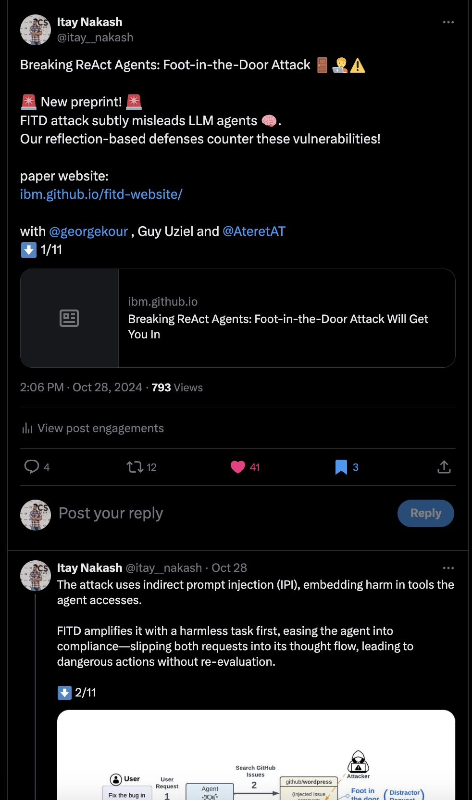

# X-for-Reserach
A guide to using Twitter effectively for research: stay updated on relevant papers, increase visibility for your work, and build a professional network.

# Twitter for Research

## 0. Why Use Twitter?

### Stay Updated on New Papers
Twitter’s recommendation algorithm is highly effective for discovering relevant papers and discussions. By tailoring your feed, you can consistently access cutting-edge research updates.

### Increase Exposure for Your Work
Publishing research on Twitter can significantly boost visibility, inviting more engagement and discussions about your work within the research community.

### Build a Strong Profile <!-- isn't that the same as exposure? -->
A strong profile attracts relevant followers and helps build credibility. Actively engaging and sharing high-quality content on your profile can solidify your presence in the research space.

------

## 1. Setting Up Your Profile <!-- too basic? -->

### Character Limits
Twitter limits each tweet to 280 characters. Researchers often use Twitter Threads—series of connected tweets—to share insights from papers or detailed content.

---

## Follow Relevant Research trends

1. **Engage with Content You Want to See**  
   - Regularly interact with posts in your field.
   - Avoid irrelevant content by manually marking posts as "Not interested in this post" via the three-dot menu on the top right.

2. **Follow Relevant Researchers**  
   - Once your profile is set up with a professional image and bio, follow researchers in your field.
   - Check followers of teammates or lab members for additional connections. Many will follow you back, enriching your feed and professional network.

## Get Exposure

1. **Publish Your Work (Papers, Blog Posts)**  
   Regularly share your published papers, blog posts, or other written work on Twitter to increase visibility within your research community. This can help attract followers interested in your expertise and encourage discussions around your work.
   Pinning key publications to the top of your profile can also keep them prominent.
1. **Share Thoughts and Insights on Topics in Your Field**  
Share your thoughts on trending topics, recent publications, or interesting findings in your field to engage your followers.
By sharing your perspective and highlighting areas in your intrest, you will establish your voice as an active contributor to ongoing conversations in your area of expertise.
1. You are the product. What value can you bring to the world? Are there specific things you value when you see them? Are there things that are easy for you to write there and others (from the right community) care about?
1. No rules. Forget about formalisms, what works is what people enjoy reading, it can be fun to read, deep but without the uninteresting parts, funny, just the bottom lines, argumentative.

# Read more

## Example of a Research Paper Thread
Split content across multiple tweets for clarity and impact.

  

